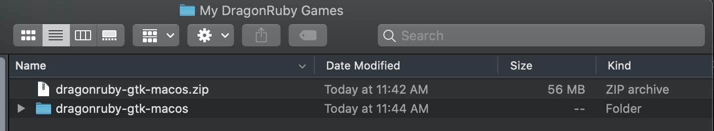
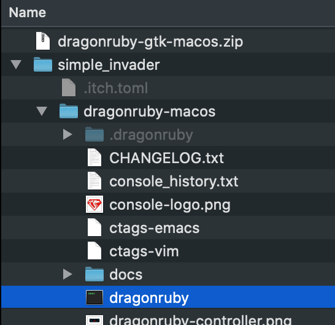

## Simple Invader DragonRuby Tutorial for Beginners

The purpose of this tutorial is to help people who are new to programming make a game in DragonRuby.

You do not need to have any experience making games or writing code. The level of difficulty should be low and if there is anything you find confusing or difficult to grasp, please visit the [DragonRuby discord](http://discord.dragonruby.com) and say what is giving you trouble.

### Setting up
To get started, go to your documents folder and create a new folder called `DragonRuby` to keep your games in.

Download DragonRuby and put the zip file in your `DragonRuby` folder. 

Extract the zip file into your `DragonRuby` folder. This should create a new folder which you can rename to `simple_invader`. Do this any time you want to start working on a new game.

Now, you should have something like this:
 

I'm taking screenshots on the Mac but you should see something similar on Windows or Linux.

Open your new `simple_invader` folder and look for `dragonruby` (on Mac/Linux) or `dragonruby.exe` (on Windows).

 

Double-click this file to run DragonRuby. You should see a new window that looks like this:

[show hello world]

We're going to call this the DragonRuby Window. Everything that happens in your game will be in this window.

Now go back to your DragonRuby folder and look in the `mygame/apps` folder for the `main.rb` file. Open this file with any text editor. On Windows, you can use Notepad.exe. On the Mac, you can use TextEdit. If you are on Linux... you probably already know what to use.

These editors are fine for writing code and very simple to use. If you want something better, try Microsoft Visual Studio Code, available for both Mac and Windows.

When you run DragonRuby, it looks in the `main.rb` file to see what to do. This is where you are going to write the code for your game.

Right now, there are already a few lines of code in the file. This code is making the "Hello World!" message appear in the DragonRuby Window.

```ruby
def tick args
  args.outputs.labels  << [640, 500, 'Hello World!', 5, 1]
  args.outputs.labels  << [640, 460, 'Go to docs/docs.html and read it!', 5, 1]
  args.outputs.labels  << [640, 420, 'Join the Discord! http://discord.dragonruby.org', 5, 1]
  args.outputs.sprites << [576, 280, 128, 101, 'dragonruby.png']
end
```

If you are feeling adventurous, you can play around with this code and see what happens. Try changing some of the numbers. Don't worry about breaking anything. 

When you are done, you can delete all the code in this file so we can start writing our own.


### Markdown


```markdown
Syntax highlighted code block
- Bulleted
- List
1. Numbered
2. List
**Bold** and _Italic_ and `Code` text
[Link](url) and 
```
For more details see [GitHub Flavored Markdown](https://guides.github.com/features/mastering-markdown/).


