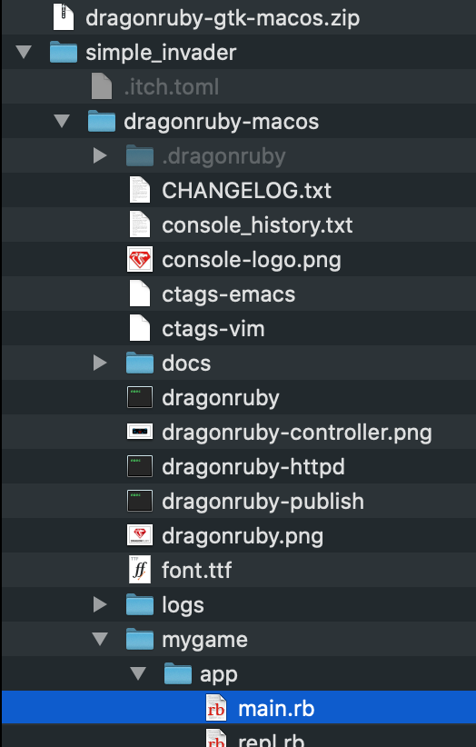

# Simple Invader DragonRuby Tutorial for Beginners

The purpose of this tutorial is to help people who are new to programming make a game in DragonRuby.

You do not need to have any experience making games or writing code. The level of difficulty should be low and if there is anything you find confusing or difficult to grasp, please visit the [DragonRuby Discord](http://discord.dragonruby.com) and say what is giving you trouble.

## Setting up
To get started, go to your documents folder and create a new folder called `DragonRuby` to keep your games in.

Download DragonRuby and put the zip file in your `DragonRuby` folder. 

Extract the zip file into your `DragonRuby` folder. This should create a new folder which you can rename to `simple_invader`. Do this any time you want to start working on a new game.

Now, you should have something like this:
 

I'm taking screenshots on the Mac but you should see something similar on Windows or Linux.

Open your new `simple_invader` folder and look for `dragonruby` (on Mac/Linux) or `dragonruby.exe` (on Windows).

 

Double-click this file to run DragonRuby. You should see a new window that looks like this:

 

We're going to call this the DragonRuby window. Everything that happens in your game will be in this window.

Now go back to your DragonRuby folder and look in the `mygame/apps` folder for the `main.rb` file. 



Open this file with any text editor like Notepad.exe (Windows) or TextEdit (Mac).

When you run DragonRuby, it looks in the `main.rb` file to see what to do. This is where you are going to write the code for your game. The code is written in a programming language called Ruby.

Right now, you should already see a few lines of Ruby code in the file. This code is making the "Hello World!" messages and the DragonRuby logo appear in the DragonRuby window.

```ruby
def tick args
  args.outputs.labels  << [640, 500, 'Hello World!', 5, 1]
  args.outputs.labels  << [640, 460, 'Go to docs/docs.html and read it!', 5, 1]
  args.outputs.labels  << [640, 420, 'Join the Discord! http://discord.dragonruby.org', 5, 1]
  args.outputs.sprites << [576, 280, 128, 101, 'dragonruby.png']
end
```

If you are feeling adventurous, you can play around with this code, save it and see what happens. Try changing some of the numbers. Don't worry if you break something. 

When you are done, delete all the code in this file.

## First code

Type the following Ruby code into the `main.rb` file:

```ruby
def tick args
  args.outputs.labels << [100, 100, "This is a DragnRuby Label"]
end
```

Save the file and look at your DragonRuby window. Whenever you change the code and save the file, DragonRuby sees the new code and automatically displays the changes.

You should see a blank window with the text "This is a DragnRuby Label" displayed in the top left corner. If you don't see it, check that your code is accurately typed and save the file again.

 

### Everything starts with a tick

This block of code starting with `def tick args` and ending with `end` is called the _`tick` method_.

When DragonRuby starts, it looks at your code to find the `tick` method. It looks at each of the following lines of code until it reaches `end`. Then, it does it again and again and again, 60 times per second.

The code you write in the `tick` method will contain _instructions_, which DragonRuby will try to follow.

We will spend more time looking at the `tick` method in a moment.

### Label

The second line of code writes some text to the DragonRuby window.

```rb
args.outputs.labels << [100, 100, "This is a DragnRuby Label"]
```

The first part of this line `args.outputs.labels <<` tells DragonRuby that we want to display a `label`. A `label` displays a line of text on the screen. The second part contains the information DragonRuby needs in order to do that.

`[100, 100, "This is a DragonRuby Label"]`

The first two pieces of information are numbers: `100` and `100`. They tell DragonRuby _where_ to display the label.

The first number says 'display this label 100 _pixels_ from the _left_'. 

The second number says 'display this label 100 _pixels_ from the _bottom_'.

We'll look at these numbers next but first, let's talk about the third item: `"This is a DragonRuby Label"`.

You probably guessed that this is the text to display. Go ahead and change the text to `"Labels let you write on the screen"` and save your code. The text should have changed in the DragonRuby window. You can type anything you want, making sure you stay between the two quotation marks.

Let's get back to those numbers. I said that the first number tells DragonRuby to display the label 100 _pixels_ from the left.

Great, but what is a pixel? Briefly, your computer's screen is made up of pixels (dots of light), packed close together in a grid. There are a fixed number of columns and rows of pixels on your screen. So, when I say '100 _pixels_ from the _left_', I mean 50 _dots of light_ from the _left_.

Fine, but 100 pixels from the _left_ of _what_? To answer that question, we're going to add another line of code.

### Doing a solid

Add a new line of code to your `tick` method. It goes after `def tick args` and before the label:

```rb
def tick args
  args.outputs.solids << [0, 0, 1280, 720]
  args.outputs.labels << [100, 100, "Labels let you write on the screen"]
end
```

`args.outputs.solids <<` tells DragonRuby to display a `solid`. This is a solid, rectangular shape.
`[0, 0, 1280, 720]` is the information DragonRuby needs in order to display the solid. In this case, it is four numbers that tell DragonRuby where to display the `solid` and _how big_ to make it.

Save the code and look at your DragonRuby window. Very probably, everything inside the window turned black. Don't panic, this is what we want to see.

By default, solids are black. We will change the color in a moment by providing some more information.

Where did the label go? It's still there but you can't see it because it's black text sitting on a black background.

Now, lets look at those numbers. The first number is `0`. This says start displaying my black solid 0 pixels from _the left_, which is to say, put the left edge of the solid right at the edge of the canvas.

The second number is also `0` and that says display the solid right on the bottom.


- tick args: what is a tick

- changing location
- tick count: show the ticks counting

- variables 1
- integers (set x, y)
- strings (set text)
- simple math (+, -, *, /)
- changing label values

- args 1
- what is args, a handy bag. We put things in, we take things out. We carry the bag wherever we want to go.

- state
- a place for variables to live
- method scope is short
- args.state keeps your variables so they don't go away
- setting default values (complex)
- now we can add to a number every tick
- show in label

# Enemy Sprite

- sprites
- make a sprite on the screen
- make the sprite move

- if statement
- if, else
- boundaries
- change sprite direction

- methods
- what is a method
- defaults, calc, render
- args again, don't forget to carry your bag
- refactor

# player sprites

- inputs
- put another sprite on screen
- make it move left and right

# shoot

- make bullets
- set boundaries

# hit

- collisions
- check for hit on enemy
- check for hit on player

# state: play, win, lose
- game over

# what now
- more bullets
- more enemies
- learn more Ruby
- chat at discord
- 


### Markdown


```markdown
Syntax highlighted code block
- Bulleted
- List
1. Numbered
2. List
**Bold** and _Italic_ and `Code` text
[Link](url) and 
```
For more details see [GitHub Flavored Markdown](https://guides.github.com/features/mastering-markdown/).


