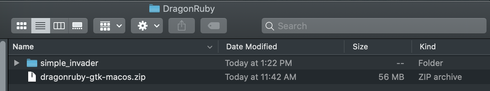

## Simple Invader DragonRuby Tutorial for Beginners

The purpose of this tutorial is to help people who are new to programming make a game in DragonRuby.

You do not need to have any experience making games or writing code. The level of difficulty should be low and if there is anything you find confusing or difficult to grasp, please visit the [DragonRuby discord](http://discord.dragonruby.com) and say what is giving you trouble.

### Setting up
To get started, go to your documents folder and create a new folder called `DragonRuby` to keep your games in.

Download DragonRuby and put the zip file in your `DragonRuby` folder. 

Extract the zip file into your `DragonRuby` folder. This should create a new folder which you can rename to `simple_invader`. Do this any time you want to start working on a new game.

Now, you should have something like this:
 

I'm taking screenshots on the Mac but you should see something similar on Windows or Linux.

Open your new `simple_invader` folder and look for `dragonruby` (on Mac/Linux) or `dragonruby.exe` (on Windows).

 

Double-click this file to run DragonRuby. You should see a new window that looks like this:


### Markdown


```markdown
Syntax highlighted code block
- Bulleted
- List
1. Numbered
2. List
**Bold** and _Italic_ and `Code` text
[Link](url) and 
```
For more details see [GitHub Flavored Markdown](https://guides.github.com/features/mastering-markdown/).


